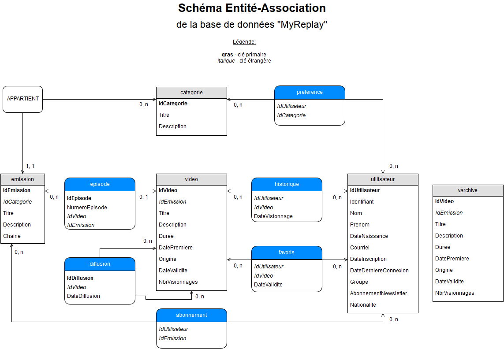

# Site de replay

Projet réalisé dans le cadre universitaire des cours de Bases de données et Programmation Web &agrave; l'Université de Strasbourg.

## Auteur

* Marek Felsoci - 2016

## Création de la base de données

### Descriptif des fichiers sources

Le fichier &laquo; dbCreateTables.sql &raquo; contient tous les scripts de création des tables et des séquences. Les commandes sauvegardées dans le fichier &laquo; dbDropAll.sql &raquo; permettent de les supprimer.

Le fichier &laquo; dbCreateTriggersBeforeTestDataInsert.sql &raquo; contient les scripts de création des déclencheurs qui sont à créer avant l’insertion de données de tests. En revanche le fichier &laquo; dbCreateTriggersAfterTestDataInsert.sql &raquo; contient les scripts de création des déclencheurs qui ne sont à créer qu’après l’insertion de données de tests car pour les besoins de tests certaines données ne respectent pas certaines contraintes au moment de leur insertion.

Le fichier &laquo; dbInsertTestData.sql &raquo; contient les commandes d’insertion des données de tests.

Et enfin, les fichiers &laquo; dbProceduresFunctions.sql &raquo; et &laquo; dbQueries &raquo; contiennent les scripts des procédures et des fonctions respectivement les requêtes SQL.

### Contraintes d’intégrité

#### Catégories, émissions, diffusions et épisodes

Une émission est reliée à une catégorie par une clé étrangère. Si une catégorie est supprimée alors toutes les émissions qui lui appartiennent le seront aussi.

Lorsqu’on supprime une vidéo correspondant au dernier épisode existant d’une émission cette dernière est également supprimée.

La table d’épisodes ne peut pas comporter deux entrées ayant le même numéro d’épisode et la référence à une seule et même émission.

Lorsqu’on ajoute une nouvelle diffusion d’une vidéo sa date de validité est automatiquement repoussée de 14 jours. L’insertion d’une diffusion échoue si sa date de diffusion se situe dans le passé.

À la suppression d’une catégorie, toutes les entrées de la table de préférences d’utilisateur qui la référencent sont supprimées en cascade. Il en va de même pour une émission et toutes les entrées des tables d’abonnements et d’épisodes. 

#### Vidéos et historique de visionnage

Une vidéo est reliée à une émission par une clé étrangère ce qui entraîne sa suppression en cascade si l’émission dont elle est l’épisode est supprimée.

La date de validité d’une vidéo doit obligatoirement être définie au moins 7 jours à compter du moment de l’insertion de la vidéo dans la table de vidéos.

Le nombre de visionnages d’une vidéo dépend du nombre de fois que la vidéo est référencée dans la table d’historique de visionnage. Ce nombre est automatiquement incrémenté de 1 lorsqu’il y a l’insertion d’une nouvelle entrée dans la table d’historique référençant la vidéo en question. 

La table d’historique de visionnage ne peut pas comporter plus de trois lignes référençant un seul et même utilisateur et ayant une date de visionnages dans un intervalle de 60 dernières secondes.

À la suppression d’une vidéo, les entrées des tables historique, diffusion, favoris et épisode qui la référencent sont également supprimées. 

La durée d’une vidéo est exprimée en minutes.

Lorsqu’une entrée de la table de vidéos est supprimée, la ligne correspondante est transférée dans la table d’archive de vidéos.

#### Utilisateur, préférences de catégorie, abonnements aux émissions et vidéos favoris

L’adresse du courriel d’un utilisateur doit être obligatoirement de la forme &laquo; *@*.* &raquo;. 

Il y a trois groupes d’utilisateur possibles : &laquo; U &raquo; pour des utilisateurs standards, &laquo; A &raquo; pour les administrateurs du site ayant accès au site de back-office et &laquo; S &raquo; pour les super-utilisateurs ayant en plus la possibilité de gérer les comptes des autres utilisateurs (y compris les administrateurs). La valeur par défaut est &laquo; U &raquo;.

Le choix d’un utilisateur de s’abonner ou non à la newsletter hebdomadaire est exprimé dans la table par un &laquo; Y &raquo; comme &laquo; Yes &raquo; ou par un &laquo; N &raquo; comme &laquo; No &raquo;. La valeur par défaut est &laquo; N &raquo;.

La nationalité d’un utilisateur est obligatoirement exprimée par deux lettres correspondant à son pays d’origine (par exemple : France – &laquo; FR &raquo;, Allemagne – &laquo; DE &raquo;, etc.)

Une préférence de catégorie est composée de deux clés étrangères référençant l’utilisateur et la catégorie qu’il préfère. 

La tables d‘abonnements à une émission a une structure analogue à la précédente mais au lieu de référencer une catégorie, les entrées référencent une émission choisie par l’utilisateur. 

Un favori est composé de la date de validité de la vidéo favori en plus des deux clés étrangères référençant l’utilisateur et la vidéo. Il peut y avoir au maximum 300 entrées référençant un seul et même utilisateur.

Si un utilisateur est supprimé alors toutes les entrées des tables de préférences, d’historique, de favoris et d’abonnements qui le référencent le seront aussi.

### Modèle logique relationnel

Les clés primaires sont en gras. Les clés étrangères sont en italique.

CATEGORIE(**IdCategorie**, Titre, Description)

EMISSION(**IdEmission**, *IdCategorie*, Titre, Description, Chaine)

DIFFUSION(IdDiffusion, IdVideo, DateDiffusion)

VIDEO(**IdVideo**, *IdEmission*, Titre, Description, Duree, DatePremiere, Origine, DateValidite, NbrVisionnages)

VARCHIVE(IdVideo, IdEmission, Titre, Description, Duree, DatePremiere, Origine, DateValidite, NbrVisionnages)

EPISODE(**IdEpisode**, NumeroEpisode, *IdVideo*, *IdEmission*)

UTILISATEUR(**IdUtilisateur**, Identifiant, Nom, Prenom, DateNaissance, Courriel, DateInscription, DateDerniereConnexion, Groupe, AbonnementNewsletter, Nationalite)

PREFERENCE(*IdUtilisateur*, *IdCategorie*)

HISTORIQUE(*IdUtilisateur*, *IdVideo*, DateVisionnage)

FAVORIS(*IdUtilisateur*, *IdVideo*, DateValidite)

ABONNEMENT(*IdUtilisateur*, *IdEmission*)

### Modèle entité-association

